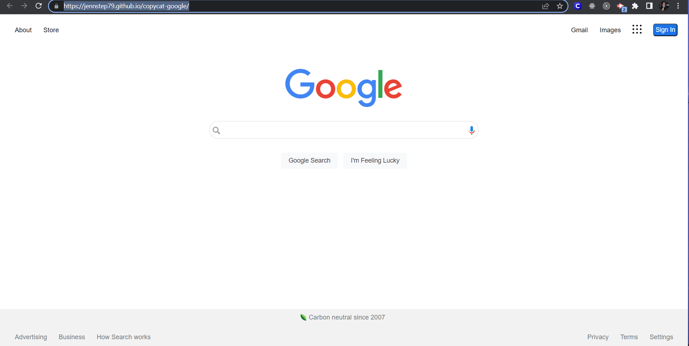

 
  

# copycat-google

As an assignment in my Fullstack Software Development Bootcamp, I was tasked with creating a clone of a popular website. I chose to recreate the Google Homepage. https://jennstep79.github.io/copycat-google/
